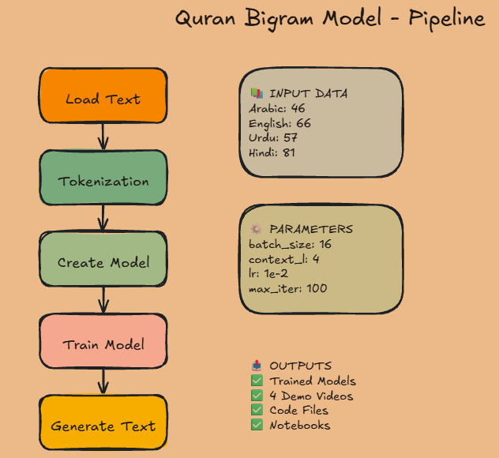

# Quran Bigram Model - Character-Level Language Model

I built a character-level bigram language model using PyTorch, trained on the Quran in 4 languages (Arabic, English, Urdu, Hindi). I made this project to understand how language models work at their core before moving to Transformers and GPT.

## 📚 What I Did

- Loaded and preprocessed Quran text data in 4 languages
- Implemented character-level tokenization from scratch
- Built and trained a bigram neural network model using PyTorch
- Generated text predictions based on the trained model
- Every line of code is documented with detailed comments and explanations

---

## 📊 Available Datasets

I cleaned and preprocessed all datasets myself:

| Language | Unique Characters | Source |
|----------|-------------------|--------|
| 🇸🇦 **Arabic** | 46 characters | Authentic Quran (Original) |
| 🇬🇧 **English** | 66 characters | Clean Translation |
| 🇵🇰 **Urdu** | 57 characters | Clean Translation |
| 🇮🇳 **Hindi** | 81 characters | Clean Translation |

**Original Data Source:** [Tanzil.net](https://tanzil.net/trans/)

---

## 🗂️ Project Structure

```
quran-bigram-model/
├── bigram-en.ipynb              # 📖 Start HERE - Fully documented English notebook
├── bigram-en-clean.py           # 🔧 Clean Python version of English model
├── bigram-arabic.ipynb          # Arabic implementation
├── bigram-arabic-clean.py       # Clean Python version
├── bigram-urdu.ipynb            # Urdu implementation
├── bigram-urdu-clean.py         # Clean Python version
├── bigram-hindi.ipynb           # Hindi implementation
├── bigram-hindi-clean.py        # Clean Python version
├── quran_en.txt                 # English Quran text data
├── quran.txt                    # Arabic Quran text data
├── quran_urdu.txt               # Urdu Quran text data
├── quran_hindi.txt              # Hindi Quran text data
├── info.png                     # Architecture flowchart diagram
├── bigram-eng.mp4               # English demo video
├── bigram-arabic.mp4            # Arabic demo video
├── bigram-urdu.mp4              # Urdu demo video
├── bigram-hindi.mp4             # Hindi demo video
├── readme.md                    # Project documentation
└── original-copyright-data/     # Source data files
```

---

## 🏗️ Architecture Overview

My bigram model follows a clean pipeline from raw text to generated predictions:

**Visual Diagram:**



The diagram above shows:

- 5 pipeline stages (Load Text → Tokenize → Create Model → Train → Generate)
- Input data specifications for all 4 languages
- Hyperparameters used in training
- All project outputs

---

## 🎬 Demo Videos

Here's my bigram model in action across all languages:

### 🇬🇧 English

<video src="bigram-eng.mp4" controls width="600"></video>

### 🇸🇦 Arabic

<video src="bigram-arabic.mp4" controls width="600"></video>

### 🇵🇰 Urdu

<video src="bigram-urdu.mp4" controls width="600"></video>

### 🇮🇳 Hindi

<video src="bigram-hindi.mp4" controls width="600"></video>

These videos show:

- Model training progress
- Text generation output
- How the model learns patterns in each language

---

## 🚀 Getting Started

### Prerequisites

- Python 3.12
- PyTorch (CPU version)
- Basic understanding of neural networks

### How to Explore

1. **Start with English** 🎯
   - Open `bigram-en.ipynb` — I documented every single line of code with comments and explanations

2. **Check the Clean Version**
   - `bigram-en-clean.py` is the clean Python version of the same model

3. **Other Languages**
   - Arabic, Urdu, Hindi — each has its own `.ipynb` notebook and `*-clean.py` file

---

## 🎓 Why I Built This

I wanted to deeply understand how language models work before jumping into Transformers and GPT. A bigram model is basically the "Hello World" of language models — it covers:

- How embeddings and tokenization work
- The fundamentals of neural network-based text generation
- The building blocks behind Transformers and GPT models

The algorithmic patterns are the same across all language models — only the architecture differs. So understanding this makes everything else much easier.

---

## ⚙️ Hyperparameters

I kept all hyperparameters **small for learning purposes and CPU compatibility**:

**English & Arabic:**

```python
batch_size = 16              # Small batch for fast iteration
context_length = 4           # Minimal context window
max_iters = 100              # Quick training cycles
learning_rate = 1e-2         # Conservative learning rate
eval_interval = 10           # Frequent evaluation
```

**Urdu & Hindi** (increased for better text generation):

```python
batch_size = 16              # Same batch size
context_length = 4           # Same context window
max_iters = 500              # More training steps for complex scripts
learning_rate = 1e-2         # Same learning rate
eval_interval = 50           # Less frequent evaluation
```

**Note:** These are optimized for:

- Running on local machines **without GPU**
- Quick iteration and understanding
- Preventing overfitting during learning
- Urdu & Hindi use more iterations due to their larger and more complex character sets

**To improve performance:**

- Increase `batch_size` (32, 64, 128)
- Extend `context_length` (8, 16, 32)
- Increase `max_iters` (1000, 5000)
- Use GPU if available (`device = 'cuda'`)

---

## 🌍 Multi-Language Support

I implemented this in **4 languages** to see:

- How character sets differ across languages
- What data cleaning looks like for different writing systems
- That the same bigram model works for any language

---

## 📝 Attribution

- **Data cleaning (Urdu & Hindi): and readme.md file** Vibe coded 🤖
- **Quran Text Data:** [Tanzil.net](https://tanzil.net/trans/)

---

## 🎯 What's Next (My Learning Roadmap)

1. **Attention Mechanisms** - The key innovation in Transformers
2. **Multi-head Attention** - Allowing models to focus on different aspects
3. **Transformers** - The architecture behind GPT, BERT, etc.
4. **Transfer Learning** - Fine-tuning pre-trained models
5. **Large Language Models** - GPT-3, GPT-4, and beyond

---

## 📚 Resources

- [PyTorch Documentation](https://pytorch.org/docs/)
- [Andrej Karpathy's "Let's build GPT from scratch"](https://www.youtube.com/watch?v=kCc8FmEb1nY)
